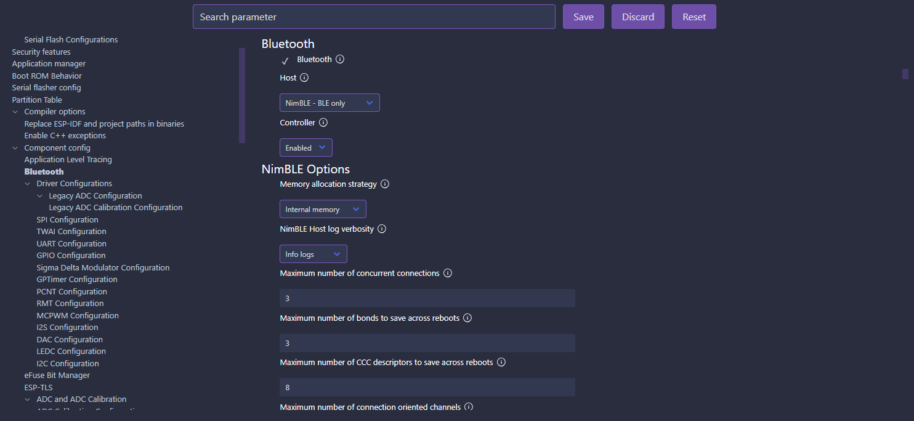

# Parte 1: Como cargar las credenciales de la conexion Wi-Fi sin hardcodearlas utilizando una Aplicacion de Android y BLE

## ESP-IDF: SDK Configuration Editor (menuconfig)

1. Ir a `Serial flasher config`.
2. En `Flash size` seleccionar `4 MB`.

3. Ir a `Partition Table`.
4. En `Partition Table` seleccionar `Custom partition table CSV`.
5. En `Custom partition CSV file` completar `partitions.csv`.

6. Ir a `Bluetooth`.
7. Marcar el check-box de `Bluetooth`, que por defecto esta desmarcado.
8. En `Host` seleccionar `NimBLE - BLE Only`.
9. En `Controller` verificar que este seleccionado `Enable`.

10. Dentro de `Bluetooth` ir a `Controller Options`.
11. En `Bluetooth controller mode (BR/EDR/BLE/DUALMODE)` verificar que este seleccionado `BLE Only`.

## ESP-IDF: Open Partition Table Editor UI

1. Presionar `CTRL+SHIFT+P`.
2. Seleccionar `ESP-IDF: Open Partition Table Editor UI`.
3. Crear el siguiente esquema de particionado:

4. Click en `Save`.

Dentro del directorio del proyecto debe crearse un archivo llamado `partitions.csv` con el siguiente contenido:

## Instalar el component para generar codigos QR por el ESP-IDF Terminal

1. Presionar `CTRL+SHIFT+P`.
2. Seleccionar `ESP-IDF: Open ESP-IDF Terminal`.
3. Ejecutar `idf.py add-dependency "espressif/qrcode^0.1.0~2"`

Dentro del directorio `main` debe crearse un archivo llamado `idf_component.yml` con el siguiente contenido:

4. Hacer un `ESP-IDF: Full Clean`.
5. Hacer un `ESP-IDF: Build Project`.

## Aplicacion Android para testing

[esp-idf-provisioning-android-playstore](https://play.google.com/store/apps/details?id=com.espressif.provble)

[esp-idf-provisioning-android-github](https://github.com/espressif/esp-idf-provisioning-android)
