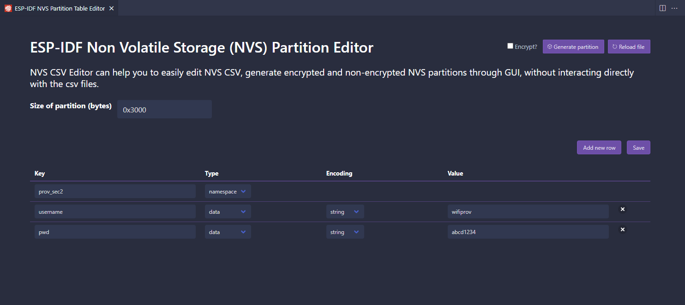
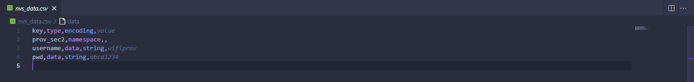
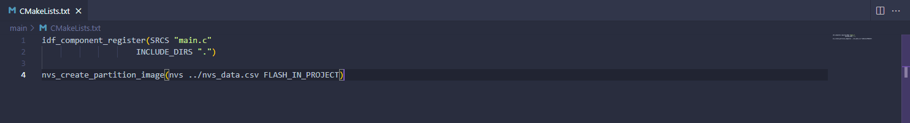

# Parte 2: Como generar una particion NVS donde vengan cargados los datos sensibles que estaban hardcodeados

## ESP-IDF: NVS Partition Editor

1. Presionar `CTRL+SHIFT+P`.
2. Seleccionar `ESP-IDF: NVS Partition Editor`.
3. Ingresar `nvs_data.csv`.
4. Presionar `ENTER`.
5. Crear el siguiente esquema de datos:

6. Click en `Save`.

Dentro del directorio del proyecto debe crearse un archivo llamado `nvs_data.csv` con el siguiente contenido:

7. Dentro de `main` abrir el archivo `CMakeLists.txt`.
8. Agregar el contenido que falta al final:

**NOTA: Excluir el seguimiento de los archivos que se llamen `nvs_data.csv` utilizando el `.gitignore` de nuestros proyectos.**
